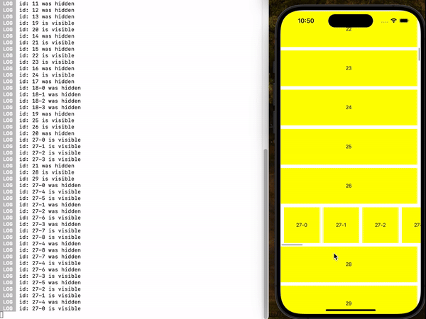
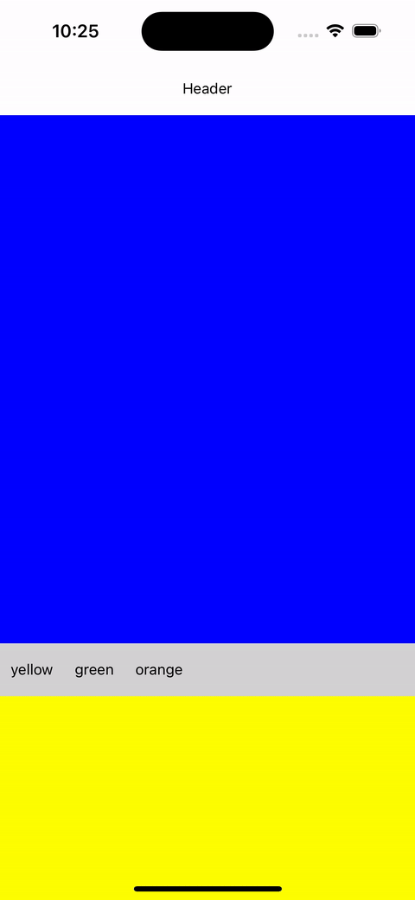

# react-native-observable-list

This library was developed as a replacement for the browser's IntersectionObserver API.

It provides item tracking functionality for lists that offer an `onViewableItemsChanged` callback with the type `({viewableItems: ViewToken[]}) => void` and a `renderItem` property with the type `({item: ItemT, index: number}) => React.ReactElement`.

- Nesting ([Example1](#example1-nesting))

- FlashList ([Example3](#example3-flashlist))

- Other Containers ([Example2](#example2-react-native-reanimated-carousel))

- Detect First Item ([Example4](#example4-detect-first-item))

## demo1 (`useInViewPort`, Example 1-3)



## demo2 (`useIsFirst`, Example 4)



## Installation

```sh
npm install react-native-observable-list
```

## Usage

You can use the `useInViewPort` hook anywhere within the item to register an event handler that will trigger when the item enters or leaves the viewport.

The newly created component with `observe` will have an `$$enabled` (optional, default is true) property.

```js
import { FlatList } from 'react-native';
import { observe, useInViewPort } from 'react-native-observable-list';
import { useIsFocused } from '@react-navigation/native';

const ObservableFlatList = observe(FlatList);

const data = Array.from({ length: 100 });

const Item = ({ id }) => {
  // The callback is re-registered whenever deps change.
  // clean is executed when an item leaves the viewport. (not unmount)
  useInViewPort(() => {
    console.log(`id: ${id} is visible.`);

    return () => {
      console.log(`id: ${id} has been hidden.`);
    };
  }, []);
  return <View style={{ height: 100 }} />;
};

const App = () => {
  const isFocused = useIsFocused();
  return (
    <ObservableFlatList
      $$enabled={isFocused} // if you need
      data={data}
      renderItem={() => <Item />}
    />
  );
};
```

## Examples

install dependencies

```
yarn install
```

run on expo android

```
yarn example android
```

run on expo ios

```
yarn example ios
```

## [Example1](./example/src/Example1.tsx) (Nesting)

It supports both reverse and forward nesting.

## [Example2](./example/src/Example2.tsx) ([react-native-reanimated-carousel](https://github.com/dohooo/react-native-reanimated-carousel))

It can also be used with containers that do not have the `onViewableItemsChanged` and renderItem props.

```js
import { observe } from 'react-native-observable-list';
import Carousel, {
  type TCarouselProps,
} from 'react-native-reanimated-carousel';

function ViewableCarousel<T>(
  props: TCarouselProps<T> & {
    onViewableItemsChanged?: ({
      changed,
      viewableItems,
    }: {
      changed: ViewToken[];
      viewableItems: ViewToken[];
    }) => void;
  }
) {
  return (
    <Carousel
      {...props}
      onProgressChange={(offsetProgress: number, absoluteProgress: number) => {
        const index = Math.floor(absoluteProgress);
        const item = props.data[index];
        props.onViewableItemsChanged?.({
          changed: [],
          viewableItems: [{ item, index, isViewable: true, key: undefined }],
        });
        props.onProgressChange?.(offsetProgress, absoluteProgress);
      }}
    />
  );
}

const ObservableCarousel = observe(ViewableCarousel);
```

## [Example3](./example/src/Example3.tsx) (FlashList)

It can also be used with `FlashList`, which offers a similar interface to `FlatList`.

In this case, you have to use a `key` in the internal list to prevent recycling.

```js
import { observe } from 'react-native-observable-list';
import { FlashList } from '@shopify/flash-list';

const ObservableFlatList = observe(FlashList);

const Example3 = () => {
  return (
    <ObservableFlatList
      // ...
      renderItem={({ index: outerIndex }) => {
        return (
          <ObservableFlatList
            key={`inner-list-${outerIndex}`} // do not recycle !!
            // ...
          />
        );
      }}
    />
  );
};
```

## [Example4](./example/src/Example4.tsx) (Detect First Item)

The callback function registered with the useIsFirst hook is triggered when the first item changes.

```js
import { useState } from 'react';
import { FlatList, View } from 'react-native';
import { observe, useIsFirst } from 'react-native-observable-list';

const ObservableFlatList = observe(FlatList);

const Item = ({
  color,
  onFirst,
  height = 500,
}: {
  color: string;
  onFirst: () => void;
  height?: number;
}) => {
  useIsFirst(() => {
    onFirst();
  }, [color]);

  return <View style={{ backgroundColor: color, height }} />;
};

const data = ['blue', 'yellow', 'green', 'orange'];

const Example4 = () => {
  const [first, setFirst] = useState<string | undefined>(undefined);
  return (
    <ObservableFlatList
      data={data}
      renderItem={({ item: color }) => {
        return (
          <Item
            color={color}
            onFirst={() => {
              setFirst(color);
            }}
          />
        );
      }}
    />
  );
};
```

## [key](./src/observe.tsx#L403-L406)

The item object is used as the `key` to store its visibility status by default.

However, if a `keyExtractor` is provided, the return value of that function is used as the key instead.

## Known Issue

### Visibility Judgment

`FlatList` considers an item component as non-existent if it doesn't occupy space (e.g., `<View />`), even if the component is within the viewport.

On the other hand, `FlashList` considers an item as existent as long as it is within the viewport, even if it doesn't occupy space.

```js
const Item = ({ id }: any) => {
  useInViewPort(() => {
    console.log(`${id} mount !!`);
    return () => {
      console.log(`${id} unmount !!`); // executed on FlatList
    };
  });

  const [hide, setHide] = useState(false);

  useEffect(() => {
    setTimeout(() => {
      setHide(true);
    }, 1000);
  }, []);

  if (hide) return <View />;
  return <View style={{ width: 10, height: 10 }} />;
};
```

Therefore, the cleanup function of useInViewPort was not designed to run when unmounted, but depending on the situation, it may still run during unmounting.

### Type Cast

I was unable to cast the input type directly to add the `$$enabled` property.

Despite trying various casting methods, both `FlatList` and `FlashList` could not infer the item type.

As a result, I had to [override the property that uses the item type in props](./src/observe.tsx#L589-L629).

Therefore, while there should be no issue when wrapping `FlatList`, if you wrap a custom component (e.g., [`Example2`](#example2-react-native-reanimated-carousel)), newly added properties like `getItemLayout`, `CellRendererComponent`, and `getItemType` might be recognized by the newly created component.

You may need to check if the original component has the same properties and override them as needed, like in `Example2`.

### Observable Lists Must Connect to the Root

I will define the component wrapped with `observe` as `Observable List`.

All lists up to the root of the item where the `useInViewPort` hook is used must be Observable Lists.

If the nested list is not an Observable List, its items will not be properly tracked.

In the example below, when the inner FlatList becomes visible on the screen, it is considered that all of its items are being in the viewport.

```js
const Example1 = () => {
  return (
    <ObservableFlatList
      style={styles.container}
      data={outerData}
      ListHeaderComponent={<View style={styles.header} />}
      renderItem={({ index: outerIndex }) => {
        if (outerIndex % 10) return <TrackableItem label={`${outerIndex}`} />;
        return (
          <FlatList // not allowed
            data={innerData}
            horizontal
            renderItem={({ index: innerIndex }) => {
              return (
                <TrackableItem
                  width={100}
                  label={`${outerIndex}-${innerIndex}`}
                />
              );
            }}
          />
        );
      }}
    />
  );
};
```

### Sticky

`FlatList` excludes items that start being managed as Sticky Headers from `viewableItems`.

Because of this, even if an item with the sticky property is visible on the screen, it may be perceived as gone.

`FlashList` duplicates sticky items and overlaps them.

Because of this, items may appear twice and be perceived as disappearing.

### useIsFirst in FlashList

In FlashList, sticky items are duplicated and overlaid with an absolute position.

This may cause state changes to not function properly. As a result, [`Example 4`](./example//src/Example4.tsx) will not work when using `FlashList`.

Additionally, since sticky headers in `FlashList` are treated as items outside of the list, any item being tracked as the first header will be considered "first" once it scrolls up by the height of the sticky header.

## License

MIT

---

Made with [create-react-native-library](https://github.com/callstack/react-native-builder-bob)
